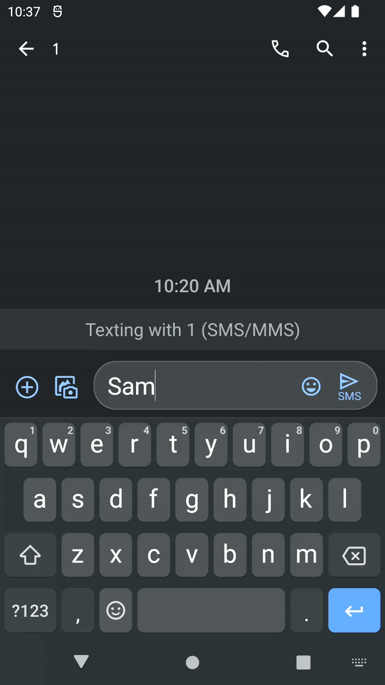

# Inline

[](https://developer.android.com)
[](https://kotlinlang.org)
[](https://www.lua.org)
[](https://github.com/hugecatdev/Inline2/releases)
[](https://www.codacy.com/gh/hugecatdev/Inline2/dashboard?utm_source=github.com&utm_medium=referral&utm_content=hugecatdev/Inline2&utm_campaign=Badge_Grade)
[](https://wakatime.com/badge/user/9506e297-1af0-4411-a6c7-9831dccdbc9d/project/468b3ecd-efde-4667-a387-67963c8e85e7)
[](https://github.com/hugecatdev/Inline2/stargazers)
[](https://github.com/hugecatdev/Inline2)

Real-time text formatting android tool | [Русский](README.md)

Type `{command}$` in any text field - messenger, browser, notes - and Inline will execute your Lua function on the spot, replacing the expression with the result. No root required.



---

### Getting started

1. Install the app
2. On newer Android versions you need to allow restricted settings before enabling the service: **App Info** > **⋮** (menu in the top right corner) > **Allow restricted settings**
3. Enable the Inline accessibility service in device settings (button in the app menu)
4. On the main screen of the app you'll find a list of modules - download and configure the ones you need
5. Type `{help}$` in a text field to see available commands

> Not all text fields are supported. Compatibility depends on the Android skin - works well on Pixel and AOSP, unstable on Samsung, poorly supported on Xiaomi (MIUI/HyperOS).

### Features

- **Commands right in your text** - type `{name}$` in any input field of any app and your Lua script processes the text on the fly
- **Custom Lua modules** - each module is a `.lua` file with commands you define yourself
- **Android API access** - LuaJava bridge gives direct access to the Android SDK from scripts
- **In-app management** - modules are downloaded and configured through the UI, each module can have its own settings screen

### Module development

Save `hello.lua` to `/sdcard/inline` and press **Reload** in the app menu (**⋮**):

```lua
local function hellocmd(_, query)
    query:answer "Hello, world!"
end

return function(module)
    module:registerCommand("hello", hellocmd, "Prints hello world")
end
```

Type `{hello}$` in a text field - done. More about the API, libraries and module capabilities - in the [Wiki](https://github.com/hugecatdev/Inline2/wiki/Inline).

> To access the `/sdcard/inline` directory, enable Storage Permission in the app menu (**⋮**).
